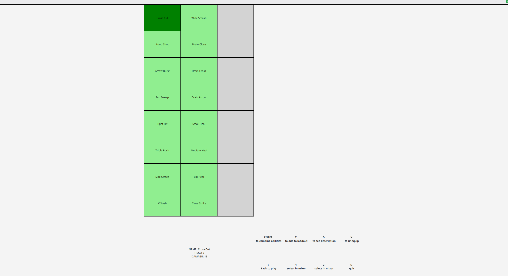
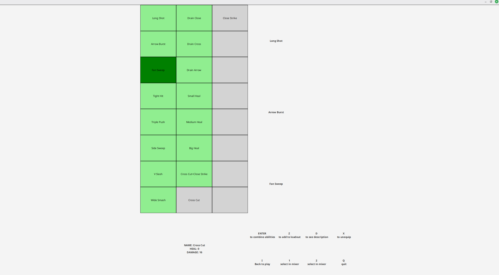
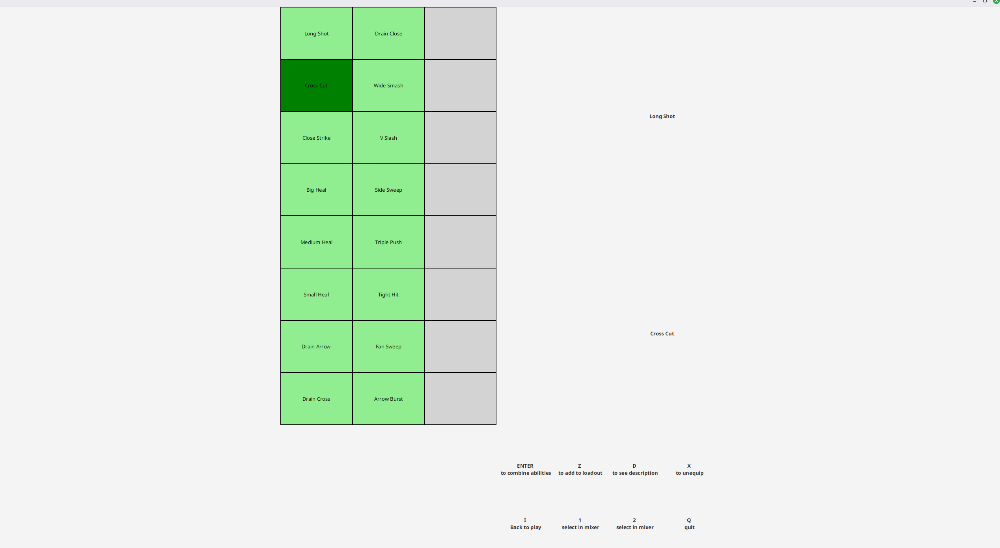
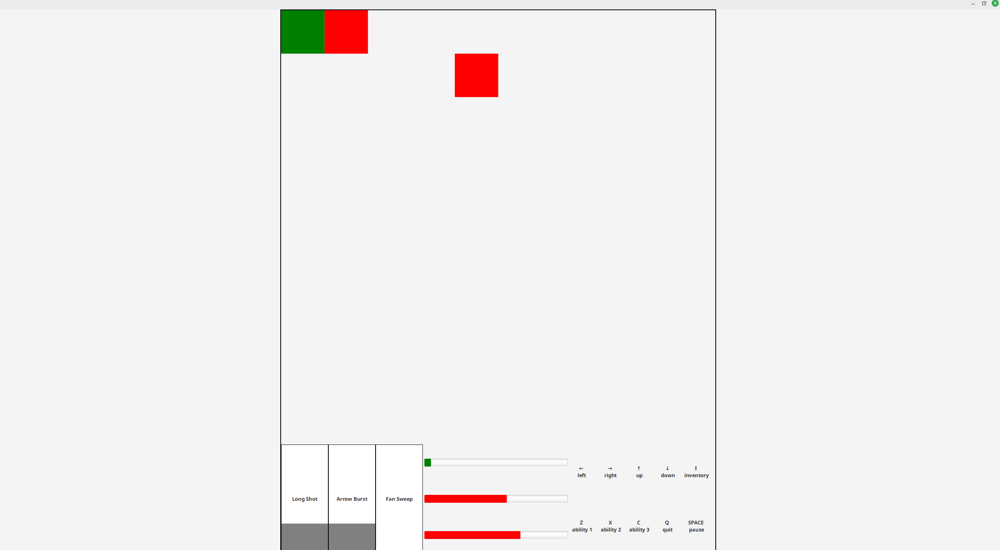
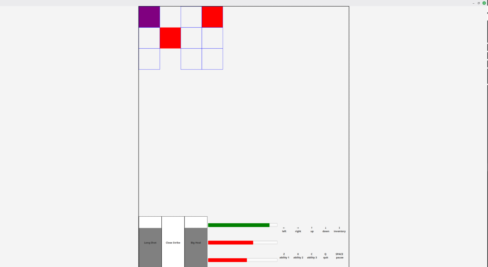

## Dot Fighting
autori
- Antonio Emanuel Balas
- Riccardo Ragazzini
- Davide Raschi
- Lorenzo Tedesco
## 1. Analisi
#### Descrizione e requisiti
Dot Fighting è un videogioco single-player di tipo PVE, in cui il giocatore affronta nemici controllati dalla CPU all'interno di una arena 2-dimensionale.

Il gioco è strutturato attorno a due scenari distinti: arsenale e combattimento.

All'interno dell'arsenale, il giocatore può prepararsi allo scontro selezionando le abilità da utilizzare in battaglia.
Per _abilità_ si intende una mossa che produce effetti su specifiche caselle del campo di gioco.
Un'abilità può curare l’entità che la utilizza, arrecare danno a un'entità ostile, oppure combinare entrambi gli effetti.
Ogni abilità è associata a un tempo di _cool-down_, durante il quale non può essere nuovamente utilizzata.

Il sistema consente inoltre di combinare due abilità per crearne una nuova, più potente.
Tali abilità, denominate _abilità combinate_, presentano caratteristiche che dipendono dalle abilità di partenza.
Ad esempio, il raggio di azione di un’abilità combinata è spesso determinato dall'unione dei raggi di azione delle abilità che la compongono.

Nello scenario di combattimento, il giocatore si confronta con nemici dotati di abilità simili a quelle in suo possesso.
Anche gli spostamenti sul campo di gioco sono soggetti a un tempo di _cool-down_, in maniera analoga alle abilità.

Inoltre i nemici dispongono di abilità speciali in grado di alterare o disturbare le azioni del giocatore.
Tali abilità hanno effetto sull’intero campo di gioco e agiscono per un intervallo di tempo limitato.

In seguito a una vittoria in combattimento, al momento dal ritorno all'arsenale, il giocatore riceverà nuove abilità che possono essere utilizzate direttamente o combinate con quelle già possedute.
Le abilità combinate impiegate in combattimento vengono separate nelle loro componenti originarie al momento del rientro nell'arsenale. In questo modo, il giocatore può fare combinazioni differenti per il prossimo combattimento.
###### Requisiti funzionali
- Il sistema deve permettere al giocatore di affrontare una sequenza di combattimenti contro nemici controllati dalla CPU
- Il sistema deve gestire due scenari distinti, arsenale e combattimento, consentendo il passaggio dall'uno all'altro
- All'interno dell’arsenale, il sistema deve consentire al giocatore di selezionare e configurare le abilità da utilizzare nel combattimento successivo
- Il sistema deve supportare l'utilizzo di abilità che producono effetti su specifiche aree del campo di gioco, includendo effetti di danno, o entrambe
- Il sistema deve impedire l'utilizzo ripetuto di una stessa abilità prima del termine del relativo tempo di _cool-down_
- Il sistema deve consentire la combinazione di due abilità per generarne una nuova con caratteristiche derivate da quelle di partenza
- Durante i combattimenti, il sistema deve gestire i movimenti del giocatore sul campo di gioco, applicando un tempo di _cool-down_ anche agli spostamenti
- Il sistema deve gestire nemici dotati di abilità speciali in grado di influenzare temporaneamente l'intero campo di gioco
- In seguito a una vittoria, il sistema deve ricompensare il giocatore con nuove abilità disponibili nell'arsenale
- Il sistema deve separare automaticamente le abilità combinate nelle loro componenti originarie al rientro nell'arsenale
###### Requisisti non funzionali
- Il sistema dovrà garantire una chiara separazione tra logica di gioco e presentazione, al fine di migliorare manutenibilità ed estensibilità
- Il sistema dovrà garantire una risposta tempestiva alle azioni del giocatore, assicurando un'esperienza di gioco fluida
- Il sistema dovrà essere progettato in modo da consentire l'aggiunta di nuove abilità e nuovi nemici senza modificare il comportamento esistente
- Il sistema dovrà essere eseguibile su ambienti standard per videogiochi desktop senza richiedere risorse computazionali elevate
- Il sistema dovrà garantire un comportamento deterministico della logica di gioco a parità di condizioni iniziali
#### Modello del Dominio
Dot Fighting è caratterizzato da una rigida divisione tra due fasi principali, la gestione strategica delle abilità nell'arsenale e la fase di combattimento.

Al centro del dominio di combattimento ci sono le entità, generalizzazione che raggruppa sia il giocatore che i nemici.
Ogni entità ha: 
- uno stato vitale
- una posizione nel campo
- dei cooldown: ogni movimento e abilità è soggetto a cooldown
- equipaggiamento, un insieme di abilità dell'arsenale, da usare nello scontro

Una differenza importante tra le due entità risiede nelle abilità
- il giocatore ha la responsabilità di combinare le abilità del proprio Arsenale trattandole come ingredienti per forgiarne di più potenti, a costo di consumare le componenti originali
- il Nemico è caratterizzato invece dall'uso esclusivo di un'Abilità Speciale capace di alterare i controlli o lo stato del giocatore.

Le abilità rappresentano le interazioni primarie tra le entità.
Un'abilità è caratterizzata da:
- un'area d'effetto
- un effetto (danno, cura o entrambi)

Nell'Arsenale le abilità assumono la natura di risorse componibili definendo il concetto di Combinazione.
La combinazione è abilitata tra alcune delle abilità iniziali, mentre per sbloccare nuove abilità è necessario sconfiggere i nemici in battaglia.

[](https://mermaid.live/edit#pako:eNp9VF1vmzAU_SvoSpXIRlD4SohVVarSSXvYpGmd9lDx4oJDrRgb2UZbmqW_fQZMGlBSP2B87rnnHvsaDpCLggCCnGGlHiguJa4ynnHHjA5zNqJ6xto59Fg7Pmua79xZDxzH7C9cU70fsUuiv9buDDmU6zH8QyiqqeBt8DfJw4crkqQaK6qa5BSzi-z7Z8ouONgIwQrxx5Sa2CDbLcn1ld089oUuaWqJudoKWbmU141Gzq_ZR37aU6ScyJFG3oPuoI_7OfCcCRJe0ZaKcMyme71n1jElqj3ab1TpN6v4dkZtOBP5zgZcjIaq78XaqX_e3Dg_CcOvplv0HLe349N8bls_OBy8CROxutPQfH43PZ6BYq_R7b9O1_T_PdBehjZz3JtJ4oWq1qnv350MIKeWopREqQnp1vfPSQzvTeeYwIVoNHhQSloA0rIhHlREVrhdQteFDPQLqUgGyLwWWO4yyPjR5NSYPwlRDWlSNOULoC1myqyausCa2M_vhOJGi8c9z085hBdEbkTDNaB4EXSigA7wF1CQRP4qTNbRMk3XyziNYw_2gKLYD9NkvVit4iRaBlF09OC1s7Hw08U6jaIwNiOJglXkASmoFvK7_SO00_E_lNhGDA)
## 2. Design 
#### Architettura
L’architettura di DF segue il pattern architetturale MVC.

Più nello specifico, il sistema è strutturato in modo tale che la classe `Controller` rappresenti l’unico punto di accesso al Model per la View.
La View non ha alcuna conoscenza diretta del Model, ma interagisce esclusivamente tramite il Controller, garantendo una chiara separazione delle responsabilità.

Il `Controller` non possiede alcuna dipendenza dalla View: la comunicazione avviene in modo _pull-based_ ed è scandita dal tempo di gioco.
In particolare, ad ogni _tick_ la View invoca il metodo `tick` del Controller per ottenere una rappresentazione aggiornata dello stato corrente del sistema.
Il flusso di controllo resta quindi in carico alla View, mentre il Controller si limita a fornire le informazioni necessarie.

Il gioco può trovarsi in due stati mutuamente esclusivi, combattimento e arsenale.
Ciascuno di questi stati è gestito da una coppia dedicata di Model e Controller, specializzati per il contesto specifico.

Il `Controller` utilizza il principio di _inversion of control_ per delegare la logica di gioco allo stato corrente, rappresentato da un oggetto che implementa l’interfaccia `ControllerState`.
Questo approccio consente di cambiare stato di gioco senza sostituire il Controller esposto alla View.
Le implementazioni concrete di `ControllerState` includono `CombatController` e `ArsenalController`, ciascuna responsabile della gestione delle regole e delle operazioni proprie del relativo stato.

Grazie a questa architettura, il sistema risulta modulare, facilmente estendibile e coerente con i principi del pattern MVC.

[](https://mermaid.live/edit#pako:eNqVVE2PmzAQ_SuWT7taoJDlI1hRpO72soeVKq3UQ8VlAhNAMXZkm223af57DeSDlO5HOYD9PO_5zYzxjuayQMpozkHrLzWUCppMEPv0CPlW4w-yG5DuWSy-Qr6BEpfLM3ijcK1QV1fXA7bPxFjjXgqjJOeoxkquNmCQsNHyU4eMZCsQBcerB7FtDam79zVZSckRxCjK1PnmuPMAyDswxhIvwc9KowDeoe_Y7H1cZv0gDKo15Jd5_8PgK8YmezUrMK8UprEt4X1huqDHbvYx1UOG78geov5Dd2RkrHjTbgtbqLfNfJjVnzTXXY6PCyM5cK7J4I18IiUaTSwdjqxRsHTdSQ8ZsbtjaYearLCC51oqYuSUPYQvfnvetDdvxE4qflb-S2TI7FxHRhoQ9j_SQ_y0dR3hooYnBnVoqeqCMqNadGiDqoFuSvsqZ9RU2GBGmR0WoDYZzcTecrYgvkvZHGlKtmVF2Rq4trOhKYcL4IRCa-TTi8hPHBQFqnvZCkNZEvaalO3oT8pc3_NDP5oFYRxEQRwH8-TWoS92Ibj1vTRO48ifxfMoCpO9Q3_1RgJvlvizJAmDeZrO49SPHIpFbaR6PNxK3Wf_B-dmcU4)

#### Design dettagliato - Balas
###### Ai dei nemici

[](https://mermaid.live/edit#pako:eNqVU02P2jAQ_SuWT6ANEYSEgIWQEHtZqe0F9VLl4k2GrFXHE_kDQSn72-sEyPKxe6gPiWfmvZk3Y_tAcyyAMppLbsyz4KXmVaaIX6dv6ydLsUJlNUoJmhxOkWbN50JZ0Buew2Lx4X7KsaqdhR-wsy_K73orrF65XVtuoX_CHTP1VYWXqpbXVQZ8y4XkrxLWVvsMpQDDyDdh7PtSnF379yt87rQGZS8hwsgH7ovqHfb_ulvmVqDqlbyCRr_39H010fR8TeAyd9Ln_2mFFHZ_jy_Q-eY-VbZyegvmzLsV507OG2kSSz8Wkfd2ATESsQ5IJYoafSP3hVo87GpUflSCy4ZyMfvsASmFAq57u9tQp_bmhsz_huHDiT7i2nPGweB6_IzAlkvnDXMhdLEwXNzNgxFnwJANamJy1EKVNKClFgVlVjsIaAW64o1J29Fl1L5BBRllfltw_TujmTp6Ts3VL8TqQtPoyjfKNlwab7m68ALOj6PzcmdxvVd5xwFVgF6hU5ayZDRrk1J2oDvK4kk4nk7j8SiJZ8M0iiaTgO4pS-NwNIxGSZrMojQdx_ExoH9aGcNwmkRJPJ5E0zQZjyYznw4KYVF_P7_X5nf8BxSdNAs)

**Problema** 
La prima sfida nella progettazione dell'entità avversaria riguardava la necessità di creare un comportamento non banale e reattivo. Si voleva evitare un'implementazione basata su macchine a stati finiti (FSM) rigide o lunghe catene di `if-else`, che avrebbero reso il nemico statico, prevedibile e difficile da estendere con nuove logiche.

L'obiettivo era ottenere un agente capace di valutare il contesto della battaglia per prendere decisioni "ragionate", evitando scatti comportamentali troppo netti o robotici.

**Soluzione**
Per risolvere questo problema, l'architettura decisionale è stata basata sulla Utility Theory. Ogni nemico è controllato da un `AiController`, il quale non possiede una logica comportamentale fissa, ma agisce come un decisore razionale.  

Invece di forzare un cambio di stato esplicito, il sistema valuta ad ogni tick quale strategia sia più vantaggiosa (ha la "utility" più alta) in base allo stato corrente del gioco, delegando l'esecuzione quella più vantaggiosa.

Per garantire valutazioni organiche, i fattori decisionali (es. salute bassa, distanza dal nemico) sono modellati tramite curve matematiche (logistiche, esponenziali) fornite dalla classe `CurvesUtility`. Questo design permette di calibrare l'aggressività o la cautela dell'IA modificando i parametri delle curve, senza alterare la logica del codice.

[](https://mermaid.live/edit#pako:eNqFlG1P2zAQx7-KZQktaG1E24TSCCEV2DQkmCbRvZnyxjhHauHYke0gQtd-9l0eWpIGaXmRh7v_Ob_c_Z0N5ToBGlEumbW3gqWGZbGKFcGjjpGluNHKGS0lmLssl2TTZMfslQnJniQ8OsMcpAIsici9sG63FG2s3LViXhgDyu3DKPzQNJKvXGd54eAnvLk7hXdeyjKo3o2B00az3aOdnJBbeBZKvAutgCQg5Zc7VJpnxrlgff7DS1vy6ri8FK0crq4-wl2IJXe4eI8CsUWF1i1gkhcS1__thBSuPNYnusAWDfEPTSMo5gYcdKF_GbC2MHCMvu2KvlnO8p7kE9GjY08I9v657oBzL16xh4IkgiwtKpu-eu1HnfYb2nTG9vtZNNJeN50pr8G6pXOMv3iOmRT2o6zzmX6F79rUGpF9IsAFVvoHMOkdO6BhWTFE4bbF_D9QxtSaIY26RZsyxcHLJyOST5vJdueKIA9IZ1d6medGM772sMK4EWkpW6tXoh3pFNbtduV1uSpz8KrT6X5bVA5Nwew6nzLYXXo87m2NSnIY3eVf3x94Y6joG2OYH3iies3Acr5_9THrWB257Sg7tNmRoKLY-6ZK9ScXKzqiqREJjZwpYEQzMBmrHmk905i6NWQQ0whvE2ZeYhqrLdbkTP3ROtuXGV2kaxo9M2nxqcgTZGn_aocoK5x-LBU_1IBKwNzoQjkaTc6DsF6VRhv6RqNZ6Iez8Gx6HuJpMV3MR7RE1WTqB0E4m88wOQnPp-F2RN9rjjP_IpgF88UkvLhYBMHZBJeDRDhtHto_bXXZ_gMvoc_K)

**Problema**
Definito il metodo decisionale, emergeva il problema di come implementare i diversi comportamenti mantenendo il codice pulito.

Inserire tutta la logica di movimento e attacco in un'unica classe avrebbe violato il principio di _Single Responsibility_, rendendo il sistema difficile da estendere con nuove tattiche e prono a duplicazione del codice.

**Soluzione**
Si è scelto di adottare il Strategy Pattern. L'interfaccia `AiStrategy` definisce il contratto comune, mentre le implementazioni concrete (es. `PressureStrategy`, `EscapeStrategy`) incapsulano gli obiettivi da perseguire.
Questo garantisce il disaccoppiamento tra la selezione dell'azione (gestita dal Controller) e la sua esecuzione.

Per rispettare il principio DRY e massimizzare la coesione, l'implementazione delle strategie si appoggia su due livelli di astrazione ausiliari:

- Livello Base (`TacticsUtility`): Incapsula le primitive geometriche e le operazioni fondamentali sull'arsenale (es. calcolo Manhattan distance, filtraggio abilità).
- Livello Semantico (`AiActions`): Aggrega le primitive per costruire azioni complesse (es. "esegui attacco", "mira al bersaglio"). Grazie a questa stratificazione, le strategie possono invocare operazioni di alto livello ignorando la complessità geometrica sottostante.

**Costruzione e Configurazione**
Infine, per gestire la creazione di nemici con caratteristiche diverse, è stato adottato il Builder Pattern tramite la classe `AiControllerBuilder`. Questo approccio permette di configurare in modo flessibile l'identità del nemico, il suo arsenale (loadout) e il set di strategie disponibili, facilitando l'introduzione di nuove tipologie di avversari senza modificare la logica di costruzione esistente.

###### Creazione nemici

[](https://mermaid.live/edit#pako:eNp9U11r2zAU_StCULpSx9hOYjumBEqywaB9ytjD8Isq3SZismQkeZsX0t9e2UoTe20msOX7ce45utfaY6oY4AJTQYxZc7LVpCplKZFbvQ-tVPVE7EpJq5UQoNHeR7s1MTX5LT9LqNpP_XsNz1xyy5VE0Nk3PvcwLtmnfiHUKt0Oy93dGUssp8vl2XdLNRALnuM70GSNamV6ihv0D-dlsoGuEZ8GqjQb8e1qxKUdOIQiTDUWPXBjX-6fuOC2fRnEjdVO4JaDz9h4s_3W1jBKq4FyItDG78dCH0r2LX90kxFDubeEsf_1-qz7VO_d8MJwOW5_gSgRwiDfeVSB3SnmwaO8E3BA67D9cMwFsslkOTpLgdwJjFc7hPjoBQYlTVN1FB5xdfVw_XWNGEeaO2FSoQ47rPOWZ0D_AvezcOS6Ts-qavdwgQzYpu7A4vqen0XjAG81Z7iwuoEAV6Ar0pm4H0SJ7Q4qKHHhPhnRP0tcyoPD1ET-UKp6g2nVbHe4eCbCOKupmevS8XadvKSxatNKesKAZKBXqpEWF3EeT_uquNjjP7hIFmEW51k8T9MsS2ZpHODWZaVZmM2TLI3zWZQn0fQQ4L-9jChcZLNsGs3neRrF00WSBhhY17HH44XvtsMr1LpLuQ)

**Problema**
La creazione di un'entità avversaria presentava una duplice sfida: la complessità dell'assemblaggio dei componenti (statistiche, loadout, AI) e la gestione del momento in cui il nemico deve essere istanziato.

Delegare la logica di costruzione direttamente al `CombatModel` avrebbe violato la separazione delle responsabilità, in quanto il Model dovrebbe limitarsi a gestire lo stato della battaglia e non la logica di progressione dei livelli o la selezione casuale degli archetipi. D'altra parte, caricare il `CombatController` di dettagli costruttivi avrebbe reso il codice di controllo eccessivamente verboso e accoppiato.

**Soluzione**
Si è scelto di centralizzare la logica di assemblaggio nella classe `EnemyFactory`, implementando il Factory Pattern. Questa classe agisce come un catalogo di archetipi (es. "Sniper", "Tank"), nascondendo i dettagli di inizializzazione.

Il flusso di creazione segue:
1. Il `CombatController`, che gestisce il flusso di gioco, determina il livello di difficoltà e richiede un nuovo nemico alla Factory.
2. La Factory produce un'istanza di `EnemyDefinition`, un Java Record immutabile che funge da _Data Transfer Object_, contenente tutte le specifiche (Hp, Ai, Loadout).
3. Il Controller passa questo DTO al `CombatModel`, che lo utilizza per inizializzare lo stato del nemico restituendo l'id da associare al relativo `AiController`.

Questo approccio garantisce che il Model rimanga agnostico rispetto alla logica di generazione dei nemici, ricevendo solo dati completi e pronti all'uso.

#### Design dettagliato - Ragazzini
###### Interfaccia grafica
**Problema**:
La progettazione della view necessitava dei seguenti requisiti:
- Un'interfaccia comprensibile e facilmente fruibile
- La costruzione dell'applicazione su più schermate 
- Consentire l'aggiunta futura di schermate o ampliamenti

**Soluzione** 
Dopo una attenta valutazione del problema si è scelto di creare due classi distinte ma accomunate dallo stesso stage che scambia le "scene" in base alle necessità.
La classe principale, inoltre, gestisce gli input delle periferiche senza delegare alcun tipo di controllo alle due classi responsabili dell'interfaccia grafica. In questo modo le due classi che si occupino della grafica mentre lo stage principale sarà l'unico ad interfacciarsi con il controller.

[](https://mermaid.live/edit#pako:eNqNUslOwzAQ_RVrTq26KEubxUJIpQgu9FTEAeVi6iG1iO1iO4VS-u8kaSkpi8QcLM_y5r1neQsLzREoLApm7aVguWEyU6SKGRNq7liO5Ox9MCDXTOKFZob_2p08iEK4zQxVman9RLPxa267r9bRs44Z1-m2Kqic2bQrAycWTyeFtbAlK6ZLpnL8bOzaVEeFLarBfIEKia3PFp3BR4N22akhlTqHJLfdn_2Dq86NsO7skNwJfDkn-FyK1Qr5EdTL0TVcnS6hZP7FdyKx9Uz_FzkxFhUrftPJOD-svNVTLR9ExS-UI4KfupF6jVdGy79nStVY-t752xb0ITeCA3WmxD5INJLVKTTGMnBLlJgBra6cmacMMlVjVkzday0_YUaX-RLoIytslZUrXnk8_MLjCCqOZqpL5YAGQTxulgDdwitQf-QPvSQK4tBPw3CchkkfNkBH0TD2PD9KIi-N_NQf7frw1tB6wzgJxlES-ME4jQM_jHcfUDDo2w)
###### Salvataggio progressi
**Problema**:
Il problema affrontato riguarda la progettazione di un sistema che consenta il salvataggio dei dati di una partita, permettendo al giocatore di interrompere l'esperienza e riprenderla successivamente senza avere continuamente l'applicazione in esecuzione. 
Le difficoltà principali consistevano in: 
-  Dove memorizzare lo stato del gioco
-  Come separare i dati statici delle abilita da quelli dinamici delle abilità.

**Soluzione** 
La soluzione iniziale optava per la modifica in-place del file `abilities.yml` utilizzandolo come unico file per ogni tipo di archiviazione.

Vantaggi: 
- Implementazione semplice e rapida.
- Nessun nuovo file 

Svantaggi: 
- Accoppiamento della configurazione iniziale e dei progressi dell'utente.
- Una manutenibilità dei dati e del codice peggiore 
- difficoltà maggiore nella distribuzione del gioco separatamente dai progressi personali.

La soluzione finale opta per l'introduzione di un file locale separato da `abilities.yml` ottenendo i seguenti vantaggi. 
Vantaggi: 
- Separazione ben definita dei dati statici e dinamici 
- Migliore estensibilità in caso di aggiunta di nuovi dati da memorizzare
- Maggiore scalabilità.

#### Design dettagliato - Raschi
###### Controller per arsenal e combattimento
[](https://mermaid.live/edit#pako:eNq1VMGO2yAQ_RU0p0TNWmtjJw6KIrWptOphT9tT5QtrzzrWYogwltpN8-8LtpMlWTfKpVyA4b03Mw_EHnJVIDDIBW-a7xUvNa8zSezYKGm0EgI1ubtbe9snww1eYrogWf0NAvJVNyi5-Di7gt2o-pkbH9qDH3iNnyW9zBeAXmc4H8_nmjixGClRorar5oj_VHbHGKKP1iVx1D0veXDHBT1U56fv4b6Pu_Gl6UsYtbQDbLksBE4quWsNIz_cNCWMPCslkEsPaKr8dWKTGv6zqq2kULJ0yFOjPlYNzUymZ9Fv3BibbAgexuvvPfSaWK0a5AILUkmD-oXnuF7_xw4uyrq4gv0NgmdP5B-S3QU6tRGE_xKuQ24qbMpGXvXhKNvrfTzym4wfq2WErjFXuhgleR5d5cAMSl0VwIxucQY16pq7LXSkDMwWa8yA2WXB9WsGmXScHZe_lKqPNK3acgvshYvG7tpdYdMOX9ApqlEWqDeqlQYYjeNOBNgefgML5_cBXS4TOg9plIZRMoM_NkrTIFrQlMZRlCZhMo8OM3jr0t4HC5rEcZrSNEyX8SK0DCwqo_Tj8Au66fAOY4udiA)
**Problema**
Il sistema deve gestire due fasi di gioco logicamente distinte, arsenale e combattimento, profondamente differenti tra loro.  
Pertanto è necessario separare le responsabilità associate a tali fasi, evitando la gestione di logica eterogenea all'interno di un’unica entità di controllo.

Inoltre, si richiede che la View interagisca con il sistema attraverso un unico punto di accesso, senza dover essere a conoscenza della sostituzione dei componenti interni responsabili della gestione della logica.  
In particolare, il passaggio tra le diverse fasi non deve comportare alcuna modifica al contratto esposto verso la View.

**Soluzione**
La soluzione adottata combina l’uso dei pattern Facade e State.

Il pattern Facade è utilizzato per fornire alla View un'unica interfaccia di accesso al sistema.  
Una singola classe `Controller` rappresenta l'unico Controller visibile esternamente e incapsula al proprio interno la complessità legata alla gestione delle diverse fasi di gioco.  
In questo modo, la View interagisce sempre con lo stesso oggetto, indipendentemente dallo stato corrente del gioco, e rimane completamente disaccoppiata dalla logica di transizione tra le fasi.

Il pattern State è impiegato per modellare il comportamento variabile del Controller in funzione dello stato corrente del gioco.  
La logica specifica di ciascuna fase è delegata a oggetti che implementano una comune interfaccia di stato, permettendo di rappresentare arsenale e combattimento come entità autonome e specializzate.  
Il `Controller` mantiene un riferimento allo stato corrente e delega a quest'ultimo la gestione degli input e l'aggiornamento dello stato di gioco.

Questa soluzione consente di modificare dinamicamente il comportamento del sistema senza sostituire il Controller principale, secondo il meccanismo di _inversion of control_.  
Il cambio di stato avviene in modo trasparente per la View, che continua a invocare gli stessi metodi indipendentemente dalla fase di gioco attiva.

Lo stesso approccio è applicato anche alla rappresentazione dei dati restituiti alla View.
A seconda dello stato corrente, il Controller produce una diversa rappresentazione dello stato di gioco, coerente con la fase attiva, mantenendo però un tipo di ritorno comune.

Grazie a questa architettura, il sistema risulta estendibile, coerente con i principi di _single responsibility_ e _open/closed_, e in grado di supportare l'aggiunta di nuove fasi di gioco facilmente.

###### Abilità speciali
[](https://mermaid.live/edit#pako:eNqVU01v4jAQ_SvRnGgLUQgQwKqQKtjV9oB6WLSHVS4mnlJvEztyHHaziP72Tj4KSdmqWl9iz7x5fvMmPkCkBQKDKOZZtpJ8Z3gSKofWUidbbteUjp0QhiE414NBuXPdazp8UVbawmGO_q2yuqIJlbDvKUaSx3dbGVPoZfNSI7rhrzyy2hSO6y4uC4h5hwoNt9jQVxL_ATzU6XLd3hqMtBGLxTk2kCrN7aZIkTnLkuKkplw3EVffuBIx9h62vzCyTgW_Ys5W6xi5akGt4Sp71CbpbU6oh9RKrXjcJbUyQdOj9JJIBDlU547tRtr-tloYCJmZPLUt6nctd8Rntsn2pLIOVhO4F1ctPp6mcbGqSYnvrP1CekdeM8yOuamRe5oHEdBgOh5ntYjPRB8_nuTbz9C68EagKtZ6jwn1RW6-o_yBkb9quyHVHo39j4KS_85aHj1fgu-VxR2as3Dow85IAcyaHPtAA054eYRKcQj2ia4NgdFWcPMcQqiOVJNy9VPr5K3M6Hz3BOyRxxmd8lSQn82zO0UNKoFmqXNlgY0Cz6tYgB3gD7DhdOIGU2_ojeczbxzMppM-FMD8oed6k4k_CmbDYOwF_uTYh7_VxZ4b-HMCzynhB6P5aNwHFJLcXjdvv_wcXwHx4Use)

**Problema**
Il sistema, durante il combattimento, deve permettere ai nemici di utilizzare abilità speciali (che chiameremo anche _disrupt_, per essere più espliciti).
Come descritto in precedenza una abilità speciale ha effetto sul giocatore ovunque esso si trovi e per un tempo limitato. È necessario realizzare le abilità speciali in modo da garantire
- possibilità di alterare (e/o bloccare) input di movimento oppure di attacco.
- possibilità di comunicare (alla View) e verificare la presenza di un disrupt attivo.
- corretta applicazione dell'effetto del disrupt, considerando che solo il giocatore ne è affetto.
- possibilità, per il nemico, di equipaggiare e utilizzare una abilità speciale.
- corretta gestione del tempo di attività del disrupt.

**Soluzione**
Le abilità speciali sono modellate tramite il record generico `SpecialAbility<T>`. Rappresentano un effetto temporaneo applicabile esclusivamente agli input del giocatore e posseggono, tra l'altro
- un token (`Class<T>`) per identificare il tipo di input su cui opera il disrupt
- la funzione che trasforma l'input che subisce il disrupt

La scelta di modellare l'effetto come una funzione permette di rappresentare in modo uniforme sia abilità che modificano l'input sia abilità che lo bloccano completamente (sia eventuali abilità che fanno entrambe le cose), favorendo l'estensibilità.

L'istanziazione dell'abilità speciale avviene con la creazione del nemico ed è responsabilità di una Factory dedicata.
Questa soluzione evita duplicazione di codice e facilita l'estensione del sistema con nuove abilità, o la modifica dei parametri di abilità speciali già note.

Nel modello di combattimento (`CombatModel`) ogni entità nemica possiede quindi una abilità speciale, mentre il giocatore non ne possiede una.
Quando un nemico utilizza la propria abilità speciale, essa viene impostata come disrupt attivo nel model, sostituendo eventuali effetti precedenti, e il relativo timer viene avviato.

L'applicazione dell'effetto del disrupt è interamente delegata al modello di gioco.
Subito prima della risoluzione dell'input del giocatore, se è presente un disrupt attivo compatibile con il tipo di input in esame, l'input è trasformato secondo il disrupt.
In questo modo View e Controller non sono a conoscenza della logica di alterazione degli input, garantendo isolamento del comportamento e prevenendo side-effect esterni.

Il controllo della durata dell'effetto è gestito dal modello tramite l'aggiornamento del timer associato all'abilità speciale durante ogni _tick_.
Una volta terminata la durata del cool-down, il disrupt attivo viene automaticamente rimosso.

Per quanto riguarda la comunicazione con View e AI, `CombatState` espone una semplice flag booleana, che segnala la presenza o meno di un disrupt attivo.

Nel complesso, la soluzione adottata concentra la logica delle abilità speciali nel modello, in modo da favorire il disaccoppiamento tra gli elementi del sistema.
Inoltre, l'utilizzo del pattern Factory facilita la creazione di abilità speciali consistenti e agevola la creazione di nuovi nemici, e il testing.
#### Design dettagliato - Tedesco
###### Abilità
[](https://mermaid.live/edit#pako:eNptUt9LwzAQ_lfKPVWsxWm3bkEG4hBfRFAZIn05m2sXbZOSZmgd-99N09XVzbzkvu9-fXfJBlLFCRikBdb1QmCusUykQ971myiEabxNIj3vVHB3SSzJGalSBVefsgNYG9J31YIKg44xqHMyf5imIv-E9WWfLXQ81ktBn_5JIrcHnW_lrjdWVdH4XRPmLSm9WNhCD5URSmJxrQmPk1u23uVnWpVPRguZ-63-vYjbTj7yd0xJmsg_cnG7k5djuhCSHkW-MgeuQxXdlB3ldCc2qF_s2dl8MCrzKMsoNf_6uzr74DCc9_X-zNvyAzmJvLoS0m4ts_PNBy4IINeCAzN6TQGUpEtsIbiFJWBWZN8ZmDU56o8E7Gg2p0L5qlTZp2m1zlfAMixqi9YVR0O7T_QbQpKTvlFraYCNXQVgG_iyYBpG8Xg8iaezeBqP4kkAjWVH4ewyjuLLiygaTayxDeDbtTwPp3E0G54AiAuj9P3uD7fX9gerSvFX)

**Problema**  
Il gioco include diverse abilità con 3 possibili tipologie (danno, cura, lifesteal) e con aree d'impatto varie. Senza una struttura chiara si rischiano due problemi: duplicare la logica ogni volta che si aggiunge una nuova abilità e di mescolare la descrizione della forma con la logica di combattimento. Serve quindi un modo per definire le abilità come "dati + comportamento", così da poter aggiungere nuovi attacchi senza modificare il combat model e mantenere le aree d’effetto riutilizzabili.

**Soluzione**  
Le abilità sono rappresentate dal record `Ability`, che descrive un'azione di gioco tramite: `id`, `nome`, `cooldown` (in secondi), variazioni di HP su chi lancia l'abilità e sul bersaglio, e una funzione `AbilityFn` che calcola le celle colpite.  
`AbilityFn` riceve la posizione del caster (`Vec2D`) e restituisce un `Optional<Set<Vec2D>>`:
- se l'abilità ha un'area, restituisce l'insieme delle celle colpite;
- se non ha area (ad esempio una cura pura), restituisce `Optional.empty`.

In questo modo il combat model resta generico: applica gli effetti sulle celle quando presenti, oppure applica solo la cura quando l'area non esiste.

La parte geometrica è separata nella classe `AbilityAreas`, che contiene metodi statici per generare le varie forme. Qui viene usato uno stile funzionale con `Stream` e `IntStream` per creare pattern simmetrici in modo compatto e senza dover scrivere a mano tutte le coordinate.   
Il metodo `fromString` fa da collegamento dato un identificatore testuale (`ADJ4`, `DIAGX`, `LINE_R`…), restituisce la funzione corretta. Così si possono aggiungere o modificare abilità direttamente nel file di configurazione (`abilities.yml`).

**Note rilevanti**  
Il tipo di abilità (`AbilityType`) non è salvato esplicitamente: viene dedotto automaticamente dai valori di cura e danno. Se un'abilità cura e infligge danno è lifesteal, se cura soltanto è heal, altrimenti è un attacco.  
Le aree d'effetto sono funzioni pure: non mantengono stato, quindi sono facilmente riutilizzabili e testabili in modo isolato.  
L'uso degli stream rende la definizione delle forme più compatta e leggibile, riducendo anche il rischio di errori soprattutto nei pattern simmetrici.
  
###### Combinazione Abilità

**Problema**  
La combinazione di due abilità deve essere commutativa (A+B = B+A) e allo stesso tempo facile da estendere. Non vogliamo duplicare logica o introdurre casi speciali ogni volta: l'obiettivo è poter aggiungere nuove combinazioni senza modificare il cuore del modello, mantenendo il sistema semplice.

**Soluzione**  
La gestione delle combinazioni è centralizzata in `AbilityCombiner`, che funziona come un registro di ricette. Ogni ricetta è una funzione che, date due abilità, genera una nuova abilità risultante.  
Per garantire la commutatività entra in gioco `AbilityPair`, questa classe ordina gli id delle abilità in modo stabile. In pratica, la chiave della coppia (A, B) è sempre uguale a quella di (B, A). Così il risultato della combinazione non dipende dall'ordine con cui le abilità vengono passate.

Le combinazioni di base sono definite in `DefaultCombinations`. Qui si registrano le coppie di abilità e la funzione che le fonde. La fusione crea una nuova abilità sommando i valori numerici delle due abilità originali (cooldown, variazioni di HP su caster e bersaglio) e unendo le rispettive aree d'effetto tramite la funzione `fuseEffects`.  
Questa funzione non fa altro che unire i set di celle colpite, mantenendo il comportamento coerente con il modello delle abilità ed evitando duplicazioni.

**Note rilevanti**  
L'unione delle aree è gestita come unione di insiemi: se due abilità colpiscono la stessa cella, questa viene comunque considerata una sola volta.  
Se entrambe le abilità non hanno area (ad esempio due cure pure), anche la combinazione risultante resta una cura pura.  

## 3. Sviluppo
#### Testing
Per il testing automatico del progetto è stato utilizzato JUnit.
In particolare, abbiamo analizzato e testato i punti ritenuti più critici, così da garantire maggiore sicurezza, robustezza e affidabilità al codice.

Inoltre, è stata configurata opportunamente la classe Controller per facilitare le operazioni di testing, rendendo più semplice l’isolamento delle componenti e la verifica del corretto funzionamento del sistema.

I test realizzati sono:
- *AbilityTest*: verifica che la creazione delle abilità avvenga correttamente, controllando l’inizializzazione degli attributi e la coerenza dei parametri.
- *ArsenalTest*: verifica il corretto funzionamento dell'Arsenal e delle sue funzioni
	- caricamento delle abilità
	- equipaggiamento delle abilità
	- combinazione delle abilità
- *CombatModelTest*: testa il combattimento, controllando la corretta gestione delle dinamiche di gioco e delle interazioni tra i vari elementi coinvolti.
- *ControllerTest*: verifica il corretto funzionamento del Controller sia in modalità Arsenale sia in modalità Combattimento, e che la gestione degli input sia consistente.
- *CooldownTest*: controlla il corretto funzionamento del meccanismo di attesa tra l'utilizzo di un’abilità e la successiva.
- *UnlockAbilitiesTest*: verifica il corretto funzionamento della classe Progress, vengono testati
	- possibilità di sbloccare abilità
	- reset del progresso
	- salvataggio dei dati

Ogni test è automatico come da specifiche di progetto.

#### Note di sviluppo - Balas
- Utilizzo di _Lambda_ in vari punti 
  https://github.com/notraschi/OOP25-df/blob/d7ce1a191b37c66f107d94dde6c83fabc0fc4551/src/main/java/it/unibo/df/ai/util/TacticsUtility.java#L220C1-L225C6 
- Utilizzo di _Optional_ in vari punti
  https://github.com/notraschi/OOP25-df/blob/d7ce1a191b37c66f107d94dde6c83fabc0fc4551/src/main/java/it/unibo/df/ai/util/AiActions.java#L34C1-L40C6
- Utilizzo di _Stream_, creo in modo random nemici di diverso tipo
  https://github.com/notraschi/OOP25-df/blob/7a945494813cabb204547216054425bc7dbd2f48/src/main/java/it/unibo/df/controller/CombatController.java#L50C1-L61C12

#### Note di sviluppo - Ragazzini
- Utilizzo di *Stream* per iterazione di elementi.  
	https://github.com/notraschi/OOP25-df/blob/7a945494813cabb204547216054425bc7dbd2f48/src/main/java/it/unibo/df/view/GameBoard.java#L144C1-L185C6
- Utilizzo di *JavaFx* per la componentisca grafica.
	https://github.com/notraschi/OOP25-df/blob/7a945494813cabb204547216054425bc7dbd2f48/src/main/java/it/unibo/df/view/SceneResizer.java#L25C5-L39C1
- Utilizzo di *Writer* contenuto in *Java.io* e di *Yaml* contenuto in *snakeyaml* per la scrittura su file. 
	https://github.com/notraschi/OOP25-df/blob/7a945494813cabb204547216054425bc7dbd2f48/src/main/java/it/unibo/df/controller/Progress.java#L79C5-L87C6

#### Note di sviluppo - Raschi
- definizione di sealed interface
	https://github.com/notraschi/OOP25-df/blob/f538f2aaea267862672da9dfcc4d19b192a50683/src/main/java/it/unibo/df/input/Input.java#L1C1-L3C68
- uso di stream, lambda expression, Optional e altri costrutti funzionali
	https://github.com/notraschi/OOP25-df/blob/f538f2aaea267862672da9dfcc4d19b192a50683/src/main/java/it/unibo/df/model/combat/CombatModel.java#L97C1-L102C20
- definizione di record e metodi generici
	https://github.com/notraschi/OOP25-df/blame/f538f2aaea267862672da9dfcc4d19b192a50683/src/main/java/it/unibo/df/model/special/SpecialAbility.java#L13-L13C33
- uso di reflection nei test
	https://github.com/notraschi/OOP25-df/blame/cc9e9c9f016ea807a3e74692e17541507bd3caca/src/test/java/it/unibo/df/CombatModelTest.java#L89C9-L89C71
#### Note di sviluppo - Tedesco
- lambda expressions
	https://github.com/notraschi/OOP25-df/blob/7a945494813cabb204547216054425bc7dbd2f48/src/main/java/it/unibo/df/model/arsenal/DefaultCombinations.java#L91C4-L103C6
- Stream / IntStream
	https://github.com/notraschi/OOP25-df/blob/7a945494813cabb204547216054425bc7dbd2f48/src/main/java/it/unibo/df/model/abilities/AbilityAreas.java#L75-L91
- Optional
	https://github.com/notraschi/OOP25-df/blob/a94181f165e5be099132df6d9535a998f0b0da16/src/main/java/it/unibo/df/model/abilities/AbilityFn.java#L20

## 4. Commenti finali
#### Autovalutazione e lavori futuri - Balas
Sono molto soddisfatto di come si è evoluto il progetto, le parti che più mi sono rimaste sono le discussioni delle varie scelte architetturali, le scelte più significative venivano discusse tutte insieme e mi sento di aver dato un notevole contributo, ad esempio i Cooldown sono semplici ma molto efficaci.

Mi sono occupato principalmente della Ai dei nemici, inizialmente non sapevo come gestire questa sfida, ho deciso di usare l'utility system cosi che i nemici potessero giudicare, fare degli alberi decisionali o delle macchine a stati finiti mi sembravano pesanti e difficili da modulare.
La scelta che ho fatto ha portato alla possibilità di creare entità che potessero implementare i comportamenti più svariati, basta creare le strategie da dargli e affidargliele negli archetipi.
Anche il pattern Builder per AiController ha portato la modularità ad un livello notevolmente superiore.
Penso di aver fatto un AI dall'architettura solida e facilmente espandibile.

In futuro sicuramente l'aggiunta di nuovi archetipi e di nuove strategia non può che migliorare il gioco.

#### Autovalutazione e lavori futuri - Ragazzini
Ritengo di aver ricoperto un ruolo fondamentale nello sviluppo del progetto, occupandomi della maggior parte della componente grafica del videogioco.
Sono consapevole che le mie competenze non siano ancora complete e che talvolta fatichi a individuare immediatamente l'approccio adatto a risolvere un problema. Nonostante ciò, considero il lavoro svolto complessivamente buono, pur riconoscendo che non sia stato perfetto e che alcuni aspetti avrebbero potuto essere curati con maggiore attenzione.
All’interno del gruppo ritengo che tutti abbiano contribuito in modo significativo.
In futuro, prevedo di aggiornare il gioco per renderlo graficamente migliore  e completo. Tra le aggiunte possibili vi sono l'introduzione di nuove tipologie di nemici, un numero maggiore di avversari e mosse differenti, con l'obiettivo di rendere il gioco più coinvolgente e piacevole per l'utente.
#### Autovalutazione e lavori futuri - Raschi
Sono nel complesso soddisfatto dello sviluppo del progetto, e del ruolo che ho ricoperto.
Credo che alcune mie scelte di design hanno favorito la realizzazione di componenti del progetto con una struttura particolarmente solida ed efficace nel contesto complessivo.
Tra cui ad esempio il fatto che `Entity` sia una inner class in `CombatModel`.

Nel complesso sono maggiormente fiero del livello di collaborazione e di intesa che c'è stato tra tutti i componenti.
In futuro, pensavo alla possibilità di aggiungere replay della partita; il modo in cui è gestito il passaggio del tempo nel model e la gestione degli input (da parte sia del giocatore che dell'AI) ne facilitano notevolmente l'aggiunta.
#### Autovalutazione e lavori futuri - Tedesco
Sono molto soddisfatto della riuscita complessiva del progetto. Il lavoro che ho svolto personalmente e le scelte di design che ho adottato si sono rivelati funzionali e hanno reso la mia parte facilmente integrabile con il resto del codice.
Penso che ci sia stato un ottimo livello di collaborazione all'interno del gruppo e che questo abbia contribuito in modo significativo alla buona riuscita del progetto. Il confronto continuo ha permesso di sviluppare un sistema solido e ben organizzato.

In futuro mi piacerebbe aggiungere alcuni strumenti di supporto, ad esempio una modalità per testare le aree d'effetto delle abilità prima della partita. Inoltre, sarebbe interessante introdurre abilità con effetti persistenti nel tempo.

## 5. Guida utente
#### 5.1 Arsenale

All'avvio del gioco viene mostrato un menu delle abilità.

- Le abilità sbloccate sono evidenziate in verde.
- Le abilità bloccate non sono selezionabili.

###### Selezione Abilità

Un’abilità può essere selezionata tramite click sinistro del mouse.

Una volta selezionata, sono disponibili i seguenti comandi:

Z | Aggiunge l'abilità selezionata al loadout  
X | Rimuove l'abilità selezionata dal loadout  
1 | Aggiunge l'abilità selezionata al combiner  
2 | Rimuove l'abilità selezionata dal combiner  
D | Visualizzare le informazioni dell'abilità

#### 5.2 Preparazione al Combattimento

Il sistema di combinazione consente di ottenere nuove abilità.
- È possibile inserire due abilità compatibili nel combiner.
- Premendo INVIO, le abilità vengono combinate.

Non tutte le abilità sono combinabili tra loro, se due mosse non compatibili sono inserite nel combiner, premendo INVIO non accadrà nulla e si resterà con le mosse precedenti.
Ecco una lista delle mosse compatibili:

- Close Strike + Cross Cut
- Long Shot + Arrow Burst
- Long Shot + Triple Push
- Tight Hit + Side Sweep
- Drain Close + Small Heal
- Drain Close + Drain Cross
- Small Heal + Medium Heal
- Triple Push + Wide Smash
- Long Shot + V Slash
- Cross Cut + Side Sweep
- Arrow Burst + Triple Push
- Fan Sweep + Wide Smash

Se le due mosse sono compatibili, viene sbloccata una nuova abilità, che compare nel menu.
Le due abilità utilizzate:
- Diventano grigie.
- Non sono utilizzabili per il round corrente.

#### 5.3 Sistema di Combattimento
###### Movimento
← | Movimento a sinistra  
→ | Movimento a destra  
↑ | Movimento verso l’alto  
↓ | Movimento verso il basso  
###### Utilizzo Abilità
Z | Utilizza l'abilità nel primo slot  
X | Utilizza l'abilità nel secondo slot  
C | Utilizza l'abilità nel terzo slot  
###### Comandi Generali
SPACE | Mette in pausa il gioco  
Q | Esce dal gioco  
#### 5.4 Sistema di Cooldown
Ogni abilità, e anche il movimento, sono soggetti a un tempo di ricarica.
Il cooldown delle abilità viene rappresentato graficamente tramite una barra verticale grigia.

Anche i nemici hanno gli stessi tempi di cooldown: quando un nemico sta attendendo che si ricarichino le sue abilità è più vulnerabile.
#### 5.5 Abilità Speciali
I nemici sono dotati di abilità speciali che possono infliggere al giocatore.

Ogni volta che il personaggio diventerà di colore viola avrà dei comportamenti modificati.

#### 5.6 Fine della Partita e Progressione
Al termine della partita:
- Il giocatore riottiene tutte le abilità precedentemente utilizzate nel combiner.
- Ottiene inoltre una nuova abilità casuale per ogni nemico sconfitto.
#### 5.7 Sistema di Salvataggio
Quando il giocatore tenta di uscire dal gioco, viene mostrato un alert di conferma che consente di scegliere tra:
- Salvare i progressi, mantenendo le abilità sbloccate.
- Resettare i progressi, azzerando le abilità sbloccate fino a quel momento.

Il sistema di salvataggio consente una progressione tra diverse sessioni di gioco.
## 6. Esercitazioni di laboratorio
- `davide.raschi@studio.unibo.it`
	- Laboratorio 07 https://virtuale.unibo.it/mod/forum/discuss.php?d=207193#p284459
	- Laboratorio 08 https://virtuale.unibo.it/mod/forum/discuss.php?d=207921#p285745
	- Laboratorio 09 https://virtuale.unibo.it/mod/forum/discuss.php?d=208718#p286609
	- Laboratorio 10 https://virtuale.unibo.it/mod/forum/discuss.php?d=209589#p287876
	- Laboratorio 11 https://virtuale.unibo.it/mod/forum/discuss.php?d=210617#p288859
	- Laboratorio 12 https://virtuale.unibo.it/mod/forum/discuss.php?d=211539#p290421
- `antonioemanuel.balas@studio.unibo.it`
	- Laboratorio 07: https://virtuale.unibo.it/mod/forum/discuss.php?d=207193#p284756
	- Laboratorio 08: https://virtuale.unibo.it/mod/forum/discuss.php?d=207921#p285943
	- Laboratorio 09: https://virtuale.unibo.it/mod/forum/discuss.php?d=208718#p287150
	- Laboratorio 10: https://virtuale.unibo.it/mod/forum/discuss.php?d=209589#p287877
	- Laboratorio 11: https://virtuale.unibo.it/mod/forum/discuss.php?d=210617#p289669
	- Laboratorio 12: https://virtuale.unibo.it/mod/forum/discuss.php?d=211539#p290767
